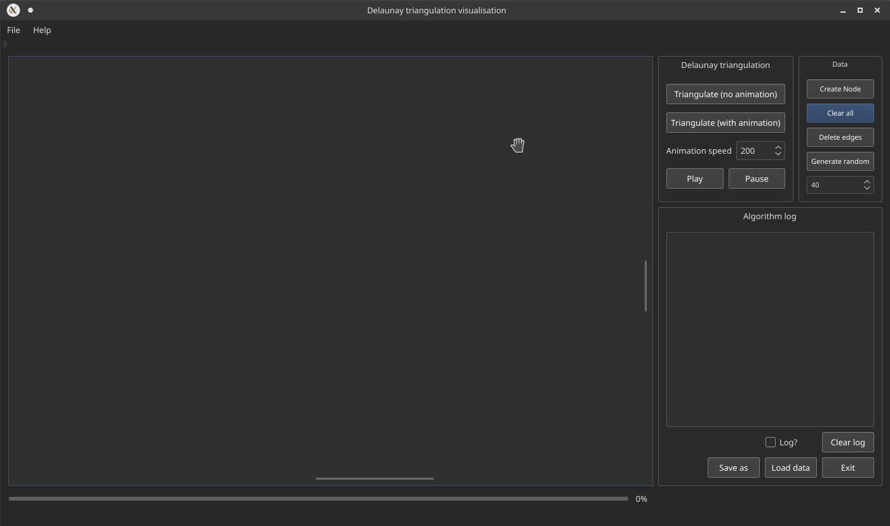
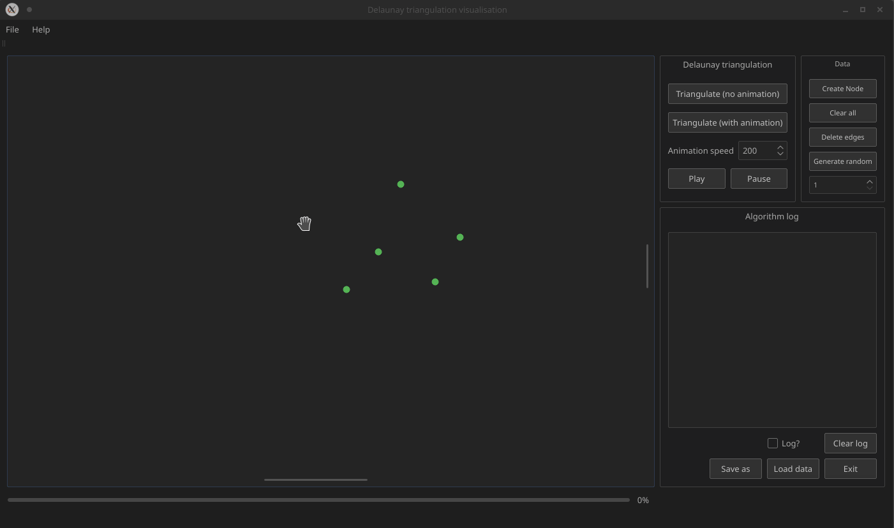

# Visualization of the Delaunay triangulation

## Course project
Project was developed as a course project for **Computational geometry** course I took on faculty during my master studies.
It shows the steps of the [Bowyer-Watson algrotihm](https://en.wikipedia.org/wiki/Bowyer%E2%80%93Watson_algorithm).

## About Delaunay triangulation
You can learn more about it [here](https://en.wikipedia.org/wiki/Delaunay_triangulation).

## Showcase
Program allows you to generate random points on a 2D plane, run
the animation showing Delaunay triangulation, and finally export your results.

You can also manually create the points on the plane.

